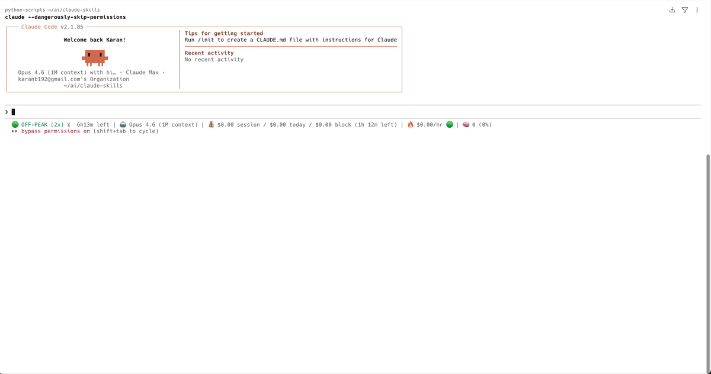

# Slack Message Formatter

A Claude Code skill that formats messages for Slack with pixel-perfect accuracy. Converts standard Markdown to Slack-compatible output with two delivery paths:

1. **Copy-paste** — Rich HTML that preserves formatting when pasted into Slack's compose box
2. **API/Webhook** — Slack mrkdwn syntax for bots, automation, and CI/CD

## Why?

- Slack uses **mrkdwn** (not Markdown). `**bold**` doesn't work — you need `*bold*`.
- Existing tools handle conversion well, but none combine **generation + preview + copy-paste** in one workflow.
- Programmatic clipboard doesn't preserve tables in Slack. Manual browser copy does.
- This skill gives you both paths: copy-paste for humans, webhook for bots.

Zero dependencies. 172+ tests. Built for Claude Code.



## Install

### Via Claude Code CLI

```bash
claude plugin marketplace add karanb192/slack-message-formatter
claude plugin install slack-message-formatter@slack-message-formatter
```

### One-liner (curl)

```bash
# Global (all projects)
curl -sSL https://raw.githubusercontent.com/karanb192/slack-message-formatter/main/install.sh | bash

# Project-level only
curl -sSL https://raw.githubusercontent.com/karanb192/slack-message-formatter/main/install.sh | bash -s project
```

### Uninstall

```bash
rm -rf ~/.claude/skills/slack-message-formatter
```

Then in Claude Code, just ask:
- "Write a Slack message announcing our v2.5 release"
- "Format this for Slack"
- `/slack-message-formatter`

### Standalone CLI

```bash
echo '**bold** and *italic*' | node src/run.mjs html
# → <b>bold</b> and <i>italic</i>

echo '**bold** and *italic*' | node src/run.mjs mrkdwn
# → *bold* and _italic_

echo '## Announcement' | node src/run.mjs preview
# → Opens browser with Slack-themed preview + copy page
```

## Features

### Copy-Paste Path (Rich HTML)
- Opens a clean HTML page in your browser
- `Cmd+A`, `Cmd+C`, then `Cmd+V` in Slack
- Preserves: bold, italic, strikethrough, links, lists, nested lists, code blocks, blockquotes, headings, task lists, tables (as code blocks), horizontal rules

### API/Webhook Path (mrkdwn)
- Converts to Slack's native mrkdwn format
- Send directly via webhook:
  ```bash
  echo '**hello**' | node src/run.mjs send
  ```
- Requires `CCH_SLA_WEBHOOK` environment variable

### Conversion Reference

| Markdown | Slack mrkdwn | HTML (paste) |
|----------|-------------|--------------|
| `**bold**` | `*bold*` | `<b>bold</b>` |
| `*italic*` | `_italic_` | `<i>italic</i>` |
| `~~strike~~` | `~strike~` | `<s>strike</s>` |
| `` `code` `` | `` `code` `` | `<code>code</code>` |
| `[text](url)` | `<url\|text>` | `<a href="url">text</a>` |
| `# Heading` | `*Heading*` | `<b>Heading</b>` |
| `- [x] Done` | `:white_check_mark: Done` | `✅ Done` |
| `- [ ] Todo` | `:black_square_button: Todo` | `⬜ Todo` |
| Tables | Code block | Code block |
| `---` | `━━━━━━━━━━` | `<hr>` |
| `:tada:` | `:tada:` (Slack renders) | `🎉` (Unicode) |

### Commands

| Command | What it does |
|---------|-------------|
| `preview` | Opens browser with copy page + dark preview |
| `send` | Sends via Slack webhook (mrkdwn) |
| `html` | Outputs raw HTML to stdout |
| `mrkdwn` | Outputs raw mrkdwn to stdout |

## Configuration

| Env Variable | Default | Description |
|-------------|---------|-------------|
| `SLACK_FORMATTER_PREVIEW_DIR` | `/tmp/slack-formatter` | Directory for preview HTML files |
| `CCH_SLA_WEBHOOK` | (none) | Slack webhook URL for `send` command |

## How It Works

```
Markdown → Parser → Dual Renderer
                    ├── Rich HTML → Browser → Cmd+C → Slack paste
                    └── mrkdwn   → Webhook → Slack API
```

1. **You write Markdown** (or Claude generates it)
2. **The converter transforms it** deterministically — same input always produces same output
3. **Two outputs**: Rich HTML for copy-paste, mrkdwn for API

Tables are rendered as aligned code blocks because Slack's paste handler breaks HTML `<table>` tags when mixed with other rich content.

## Key Discovery: Slack Paste Limitations

Through extensive testing, we discovered:

- **Programmatic clipboard** (Clipboard API, `execCommand`, `osascript`) **does not reliably preserve formatting** when pasting into Slack
- **Manual browser copy** (`Cmd+A`, `Cmd+C` from a rendered HTML page) **works perfectly** for all formatting including tables
- **HTML tables break** in Slack paste when mixed with other rich content (bold, lists, blockquotes) — even with manual copy. Tables must be code blocks.
- **150+ emoji shortcodes** (`:tada:`, `:rocket:`, etc.) are converted to Unicode for browser preview

## Testing

```bash
node test-skill.mjs                              # from repo root
node skills/slack-message-formatter/test.mjs     # from skill dir
```

Comprehensive test suite with 172+ tests covering:
- Both HTML and mrkdwn output for every feature
- Emoji shortcode conversion (85+ verified individually)
- Nested formatting, edge cases, unclosed markers
- Real-world messages (deployment, incident, meeting notes, code review, sprint summary)
- Special character escaping, Windows line endings

## Known Limitations

- **Bare URLs** (`https://example.com` without link syntax) are not auto-linked. Use `[text](url)` syntax. Slack auto-links bare URLs when sent via API anyway.
- **Relative links** (`[Docs](/path)`) are ignored — only `http://`, `https://`, and `mailto:` links are converted.
- **Deeply nested parenthesized URLs** like `(a_(b_(c)))` may not parse correctly. Single-level parens (e.g. Wikipedia URLs) work fine.
- **Tables in copy-paste** render as code blocks. Slack's WYSIWYG editor does not reliably accept HTML `<table>` tags when pasted alongside other rich content.
- **`snake_case` text** is safe — underscores inside words are not misinterpreted as italic.

## Acknowledgements

Built on the shoulders of great tools in the Slack formatting ecosystem:

- [slackify-markdown](https://www.npmjs.com/package/slackify-markdown) — the most popular Markdown-to-mrkdwn converter (207k weekly downloads). Inspired our mrkdwn conversion approach.
- [sirkitree/slack-markdown-formatter](https://github.com/sirkitree/slack-markdown-formatter) — a Claude Code skill that pioneered teaching Claude Slack formatting rules.
- [ccheney/robust-skills](https://github.com/ccheney/robust-skills) — comprehensive mrkdwn and Block Kit skills for Claude Code.
- [slackdown.com](https://slackdown.com) — web-based converter with HTML copy support.
- [Slack's official docs](https://api.slack.com/reference/surfaces/formatting) — the mrkdwn specification.

This tool adds **browser preview + copy-paste + table support** on top of the conversion these tools pioneered.

## License

MIT
